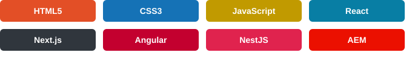

# Olá, eu sou o Marcos Alonso! 👋

### Desenvolvedor web · Front-end & Back-end

Bem-vindo ao meu espaço no GitHub! Aqui compartilho projetos, estudos e experiências com desenvolvimento de software.

- 💻 Desenvolvimento de interfaces e aplicações web.
- ⚛️ JavaScript, React, Next.js e Angular.
- 🛠️ Back-end com Nest.js e experiência com AEM.
- 🚀 Aprendizado contínuo, prática e novos projetos.

 

## Tecnologias que utilizo ✨

## Meu GitHub em números 📊

  
  

Cards gerados por um serviço externo a partir dos dados públicos do GitHub.

## Explore meus projetos 🔎

Meus repositórios reúnem estudos e projetos de desenvolvimento web, interfaces e programação.

[**→ Ver meus repositórios**](https://github.com/MarcosAlonso12?tab=repositories)

---

Obrigado pela visita! 👋

